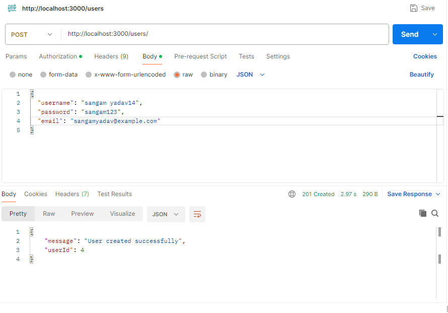
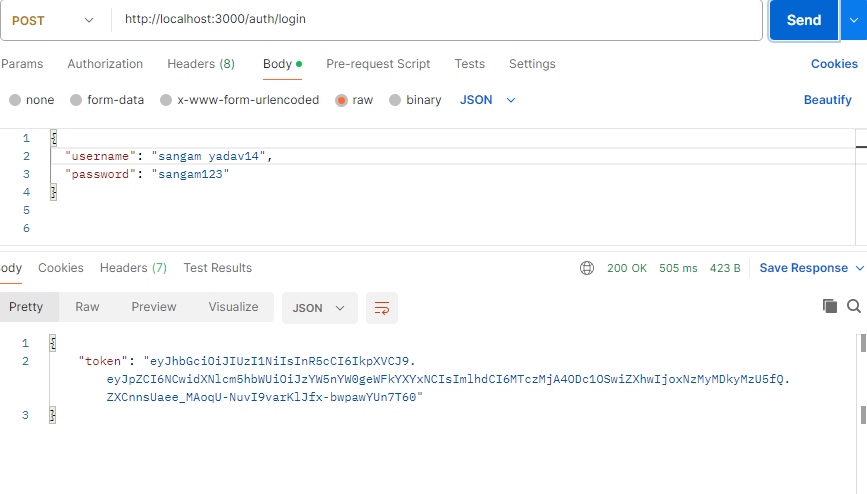
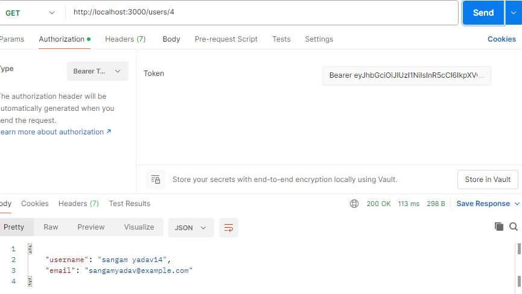
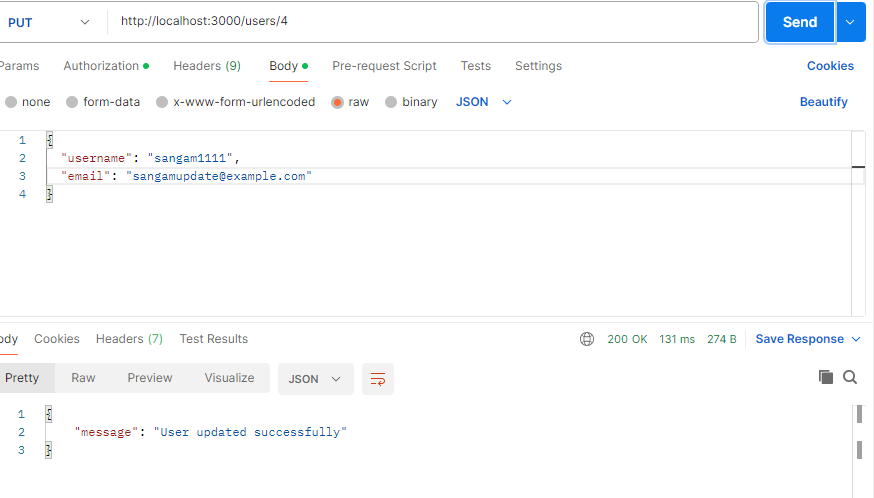
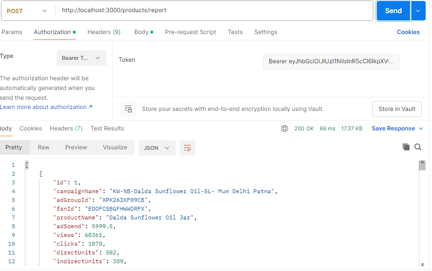
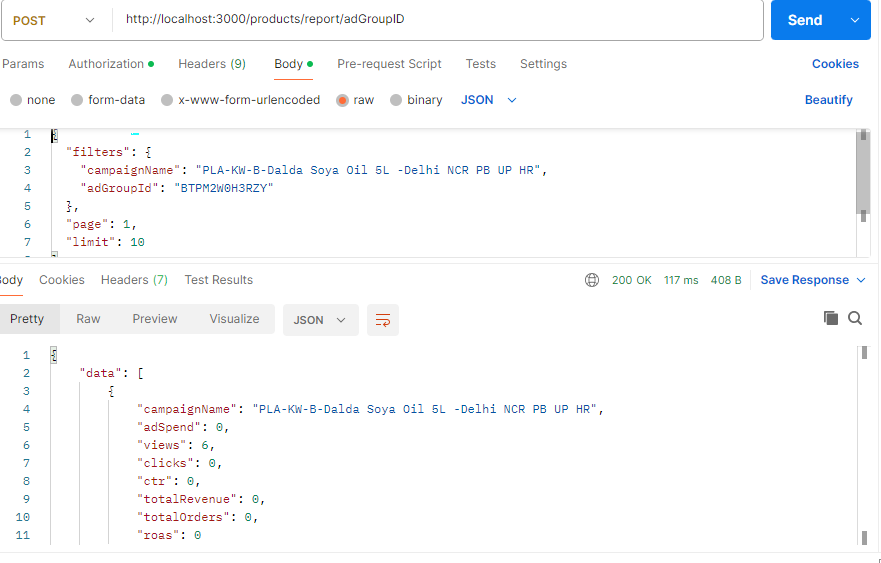
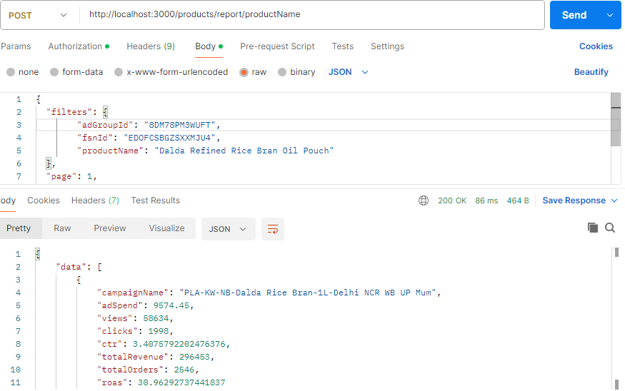

This is a Node.js-based API for managing and reporting on e-commerce campaign data. The API supports functionalities like CSV file upload, JWT-based authentication, CRUD operations for users, and product reporting with filtering, pagination, and search capabilities.

FEATURES
-----------------------------------------------------------
1. Upload CSV file to populate a products database.
2. JWT-based user authentication.
3. CRUD operations for user management.
4. Dynamic product reporting with filters (e.g., campaignName, adGroupId).
5. Pagination and search support.

Project Setup
-----------------------------------------------------------
Prerequisites
-------------
1. Node.js: Download Node.js
2. SQLite: Pre-installed with Node.js or available in the project dependencies.
3. Postman: Download Postman for API testing.

Installation
------------------------------------------------------------
1. Open your terminal (or Git Bash) and run the following command to clone the repository:

git clone https://github.com/sangam007007/ecommerce.git

2. After the clone command finishes, navigate into the project directory:

cd ecommerce

3. Run the following command to install the required dependencies

npm install

4. Set Up the Environment Variables(Already there)
In the project root directory, create a .env file with the following settings:
JWT_SECRET=your_secret_key

Replace your_secret_key with a strong, random string for JWT authentication.

5.Start the server:

====> node server.js 

Open http://localhost:3000 in your browser or API client.

6. API Endpoints

1. Upload CSV File

Endpoint: POST http://localhost:3000/products/upload-csv
Description: Upload a CSV file to populate the product database.
Payload:
Use form-data in Postman with the key file to upload the CSV file.

Add the token in the Authorization header for protected routes:

2. User Management
------------------------------------------------------------------
 1. Create User
Endpoint: POST http://localhost:3000/users/
Payload:
{
  "username": "testuser",
  "password": "password123",
  "email": "testuser@example.com"
}

 2. Authorized Login

 Endpoint: POST http://localhost:3000/auth/login

 

 Payload:
 {
  "username": "sangam yadav14",
  "password": "sangam123"
}
Response: Returns a JWT token for authenticated access.

Add the token in the Authorization header for protected routes:

 3. Get User
Endpoint: GET (http://localhost:3000/users/):id

Authorization: Bearer <your-token>

4. Update User
Endpoint: PUT (http://localhost:3000/users/):id
Payload:

{
  "username": "updateduser",
  "email": "updateduser@example.com"
}

5. Delete User
Endpoint: DELETE (http://localhost:3000/users/):id

--------------------------------------------------------------
6. get All Product Details 
Endpoint: POST [/api/products/report](http://localhost:3000/products/report)

Payload:
{
  "filterKey": null,
  "filterValue": null

}

 7. All prodect based on the filter condition

    API 1- Purpose: Retrieve product statistics filtered by Campaign Name. Additional filters like Ad Group ID, FSN ID, or Product Name can also be applied to further refine the results.
    
    Endpoint: POST http://localhost:3000/products/report/campaign

    

    Payload:
    {
        "filters": {
            "campaignName": "PLA-Cross Selling-Fiona-1L"
            },
         "page": 1,
         "limit": 10
        }
     API 2-  Purpose: Retrieve product statistics filtered by Ad Group ID. Additional filters like Campaign Name, FSN ID, or Product Name can be applied
    
        Endpoint:POST http://localhost:3000/products/report/adGroupID

    

        Payload:
            {
        "filters": {
            "campaignName": "PLA-KW-B-Dalda Soya Oil 5L -Delhi NCR PB UP HR",
            "adGroupId": "BTPM2W0H3RZY"
        },
        "page": 1,
        "limit": 10
        }
   3. API 3- Purpose:  Retrieve product statistics filtered by FSN ID. Additional filters like Campaign Name, Ad Group ID, or Product Name can also be applied.

    
    Endpoint:POST http://localhost:3000/products/report/fsnID

    

    Payload:
    {
  "filters": {
    "campaignName": "PLA-KW-B-Dalda Soya Oil 5L -Delhi NCR PB UP HR",
    "adGroupId": "BTPM2W0H3RZY",
    "fsnId": "EDOFVTFGABU8ZTWE"
  },
  "page": 1,
  "limit": 10
}

 4. API 4- Purpose:  Retrieve product statistics filtered by Product Name. Additional filters like Campaign Name, Ad Group ID, or FSN ID can also be applied.

   Endpoint:POST http://localhost:3000/products/report/productName

   

    Payload:
   {
  "filters": {
        "adGroupId": "8DM78PM3WUFT",
        "fsnId": "EDOFCSBGZSXXMJU4",
        "productName": "Dalda Refined Rice Bran Oil Pouch"
  },
  "page": 1,
  "limit": 10
}

    Description: Fetch product statistics filtered by campaign name, adGroupId, fsnId, or product name -------------------------------------------------------------------------------
8. Testing
--------------------------------
Use Postman to test the endpoints.
To test secured routes, first log in and use the token in the Authorization header.

9. Folder Structure

app/
├── config/            # Configuration files (e.g., database)
├── controllers/       # API business logic
├── models/            # Sequelize models
├── routes/            # API route handlers
├── middlewares/       # Authentication and other middlewares
└── server.js           # Application entry point

Author
Name: sangam yadav
Contact: sangamyadav926@gmail.com
